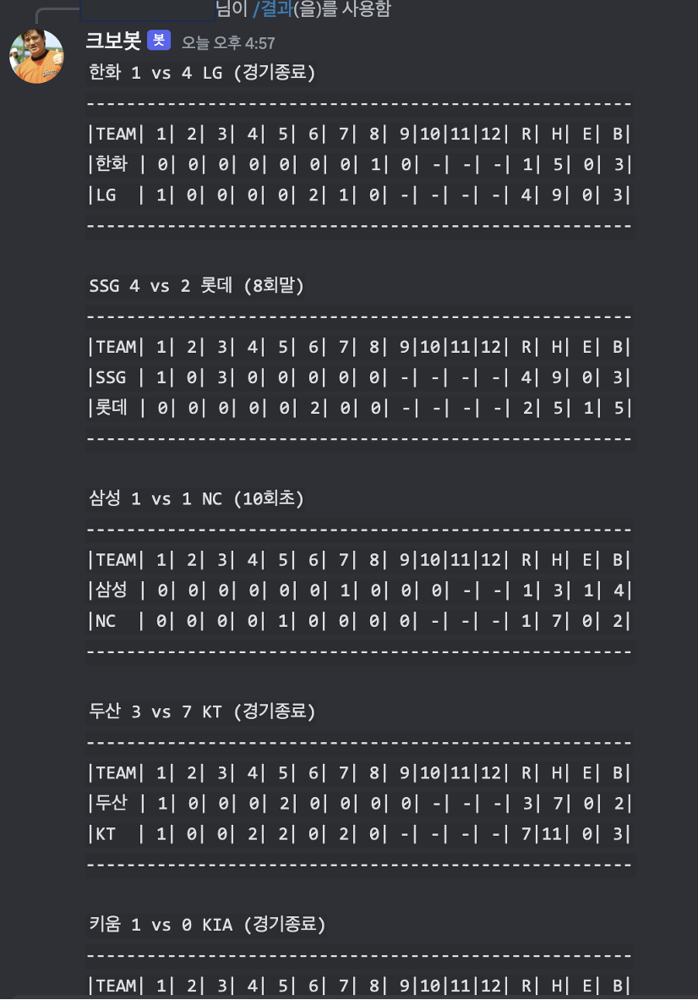
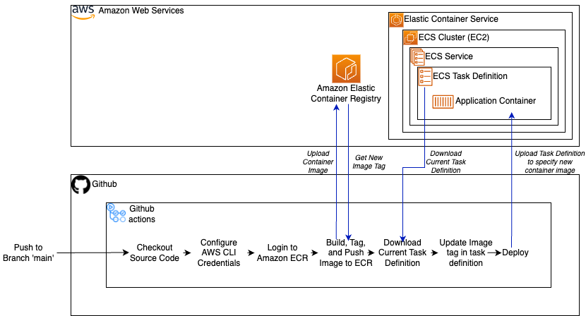

# KBO-BOT

> Check Rankings, Schedule and Live Scores of the [KBO League](https://www.koreabaseball.com/) Directly in your Discord Server!
>
> Simply add KBO-BOT to your server: https://shorturl.at/ouHIU


## Usage

```
/순위
```

현재 프로야구 순위를 출력합니다.


```
/일정
```

가장 가까운 경기일의 프로야구 일정을 출력합니다.


```
/결과
```

실시간 프로야구 경기결과를 출력합니다.




## CI/CD




## Reproduction

1. Clone this git repository.

2. Create your own discord bot [here](https://discord.com/developers/applications).

3. Create an .env file. Fill in the following:

   ``````
   DISCORD_TOKEN= your github bot token
   clientId= your github bot clientId
   ``````

4. execute the following:

   ``````shell
   npm run start
   ``````


## TODO

- [ ] Testing
- [ ] Live Commentary Updates
- [x] Check Upcomming/Past Results & Schedules
- [ ] Voice / Video livestream over live channel
